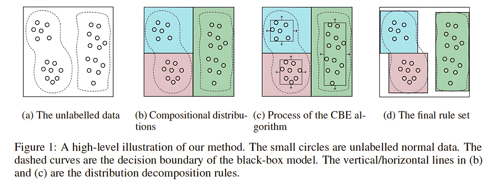

# Interpreting Unsupervised Anomaly Detection in Security via Rule Extraction

This is the project site of our paper "Interpreting Unsupervised Anomaly Detection in Security via Rule Extraction" (published on NeurIPS '23: [Interpreting Unsupervised Anomaly Detection in Security via Rule Extraction](https://openreview.net/forum?id=zfCNwRQ569)). Our primary goal is to interpret black-box unsupervised models used in security domains into rule expressions (i.e., feature vs. threshold), so that they can be understood by human experts and easily integrated with common rule-based security tools. The code is primarily developed by Ruoyu Li and Yu Zhang.




## Abstract

Many security applications require unsupervised anomaly detection, as malicious data are extremely rare and often only unlabeled normal data are available for training (i.e., zero-positive). However, security operators are concerned about the high stakes of trusting black-box models due to their lack of interpretability. In this paper, we propose a post-hoc method to globally explain a black-box unsupervised anomaly detection model via rule extraction. First, we propose the concept of distribution decomposition rules that decompose the complex distribution of normal data into multiple compositional distributions. To find such rules, we design an unsupervised Interior Clustering Tree that incorporates the model prediction into the splitting criteria. Then, we propose the Compositional Boundary Exploration (CBE) algorithm to obtain the boundary inference rules that estimate the decision boundary of the original model on each compositional distribution. By merging these two types of rules into a rule set, we can present the inferential process of the unsupervised black-box model in a human-understandable way, and build a surrogate rule-based model for online deployment at the same time. 
We conduct comprehensive experiments on the explanation of four distinct unsupervised anomaly detection models on various real-world datasets. The evaluation shows that our method outperforms existing methods in terms of diverse metrics including fidelity, correctness and robustness.


### Citation

If our work assists you, we would appreciate it if you acknowledge it in your citations：
```bash
@inproceedings{li2023interpreting,
  title={Interpreting Unsupervised Anomaly Detection in Security via Rule Extraction},
  author={Li, Ruoyu and Li, Qing and Zhang, Yu and Zhao, Dan and Jiang, Yong and Yang, Yong},
  booktitle={Thirty-seventh Conference on Neural Information Processing Systems},
  year={2023}
}
```


### Installation

```bash
git clone https://github.com/Ruoyu-Li/UAD-Rule-Extraction.git
```

### Test

Please refer to ```example.ipynb``` where we give concrete usage examples, including how to extract rules and several useful functions of the rule model.

Update: We have included three datasets used in our experiments in ```./dataset/```, which can be easily loaded by using ```load_data()``` function in ```data_load.py```.

## Our Poster at NeurIPS '23

